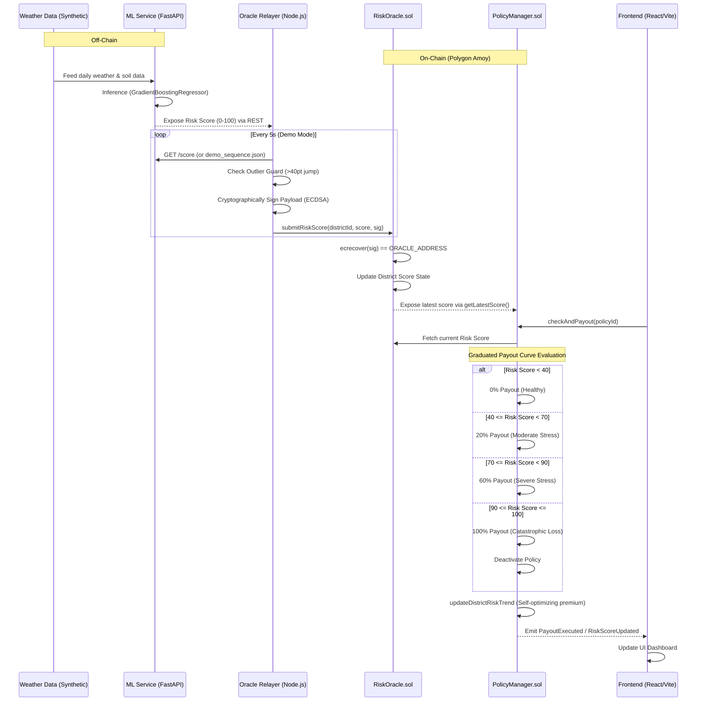

# Architecture Diagram

This diagram visualizes the end-to-end flow of the AgriGuard AI system, from synthetic data generation to the graduated payout mechanism on-chain.

```mermaid
sequenceDiagram
    participant W as Weather Data (Synthetic)
    participant ML as ML Service (FastAPI)
    participant OR as Oracle Relayer (Node.js)
    participant SC_RO as RiskOracle.sol
    participant SC_PM as PolicyManager.sol
    participant FE as Frontend (React/Vite)

    note over W,ML: Off-Chain
    note over SC_RO,SC_PM: On-Chain (Polygon Amoy)
    
    W->>ML: Feed daily weather & soil data
    ML->>ML: Inference (GradientBoostingRegressor)
    ML-->>OR: Expose Risk Score (0-100) via REST
    
    loop Every 5s (Demo Mode)
        OR->>ML: GET /score (or demo_sequence.json)
        OR->>OR: Check Outlier Guard (>40pt jump)
        OR->>OR: Cryptographically Sign Payload (ECDSA)
        OR->>SC_RO: submitRiskScore(districtId, score, sig)
    end
    
    SC_RO->>SC_RO: ecrecover(sig) == ORACLE_ADDRESS
    SC_RO->>SC_RO: Update District Score State
    SC_RO-->>SC_PM: Expose latest score via getLatestScore()
    
    FE->>SC_PM: checkAndPayout(policyId)
    SC_PM->>SC_RO: Fetch current Risk Score
    
    note over SC_PM: Graduated Payout Curve Evaluation
    alt Risk Score < 40
        SC_PM->>SC_PM: 0% Payout (Healthy)
    else 40 <= Risk Score < 70
        SC_PM->>SC_PM: 20% Payout (Moderate Stress)
    else 70 <= Risk Score < 90
        SC_PM->>SC_PM: 60% Payout (Severe Stress)
    else 90 <= Risk Score <= 100
        SC_PM->>SC_PM: 100% Payout (Catastrophic Loss)
        SC_PM->>SC_PM: Deactivate Policy
    end
    
    SC_PM->>SC_PM: updateDistrictRiskTrend (Self-optimizing premium)
    
    SC_PM-->>FE: Emit PayoutExecuted / RiskScoreUpdated
    FE->>FE: Update UI Dashboard
```
